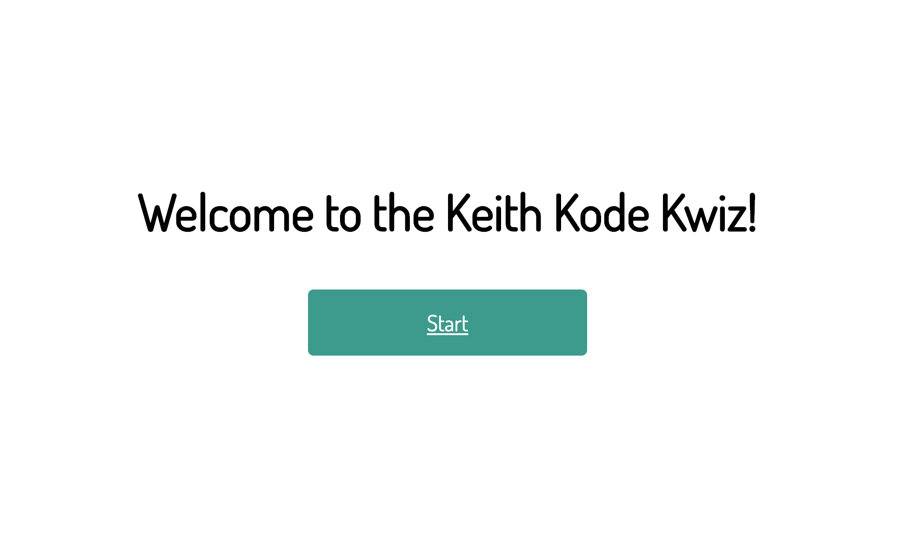
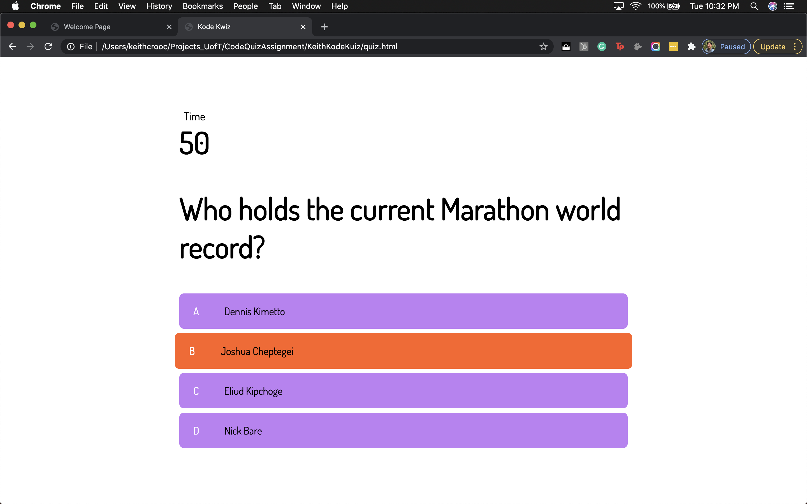
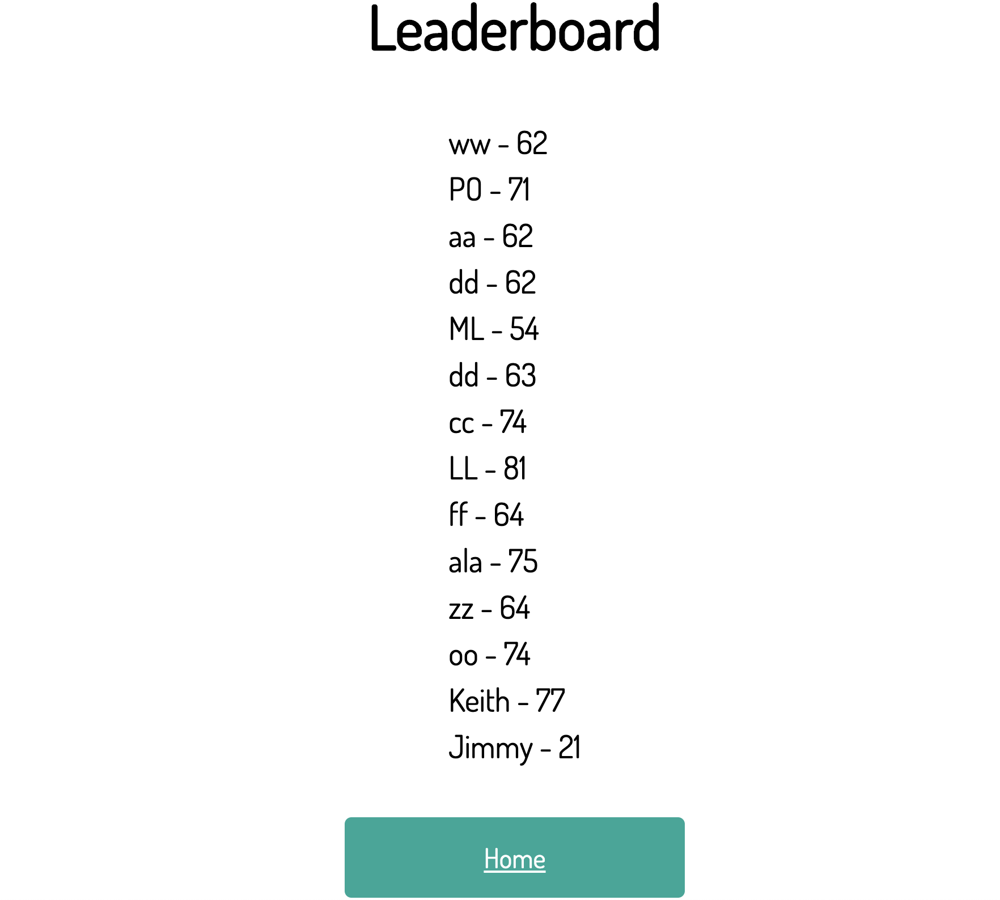

# KeithKodeKuiz
Apply Javascript & Web-APIs to store date

## Exercising Javascript

This assignment is all about bringing HTML, CSS, JS all together to make a quiz!

When a user clicks the **Start** button, the quiz begins! Displaying a question, 4 possible choices and a timer counting down.

When a choice is made it'll pull the next unanswered question out.

When the correct answer is selected, it'll turn green. If it's wrong it turns red.

Every time a wrong answer is chosen, it'll deduct 10 seconds off of the timer. 

Your score is based on how much time is left on the clock. So to get the best score, do the test as fast as possible with no mistakes.

Once the quiz is complete, the user is able to save their score together with their name or initials for it to appear on the leaderboard. The leaderboard will show up to 10 names & scores.

**You can find a link to here!** - https://keithyyy.github.io/KeithKodeKuiz/

**Here's screenshots of the quiz in action:**

